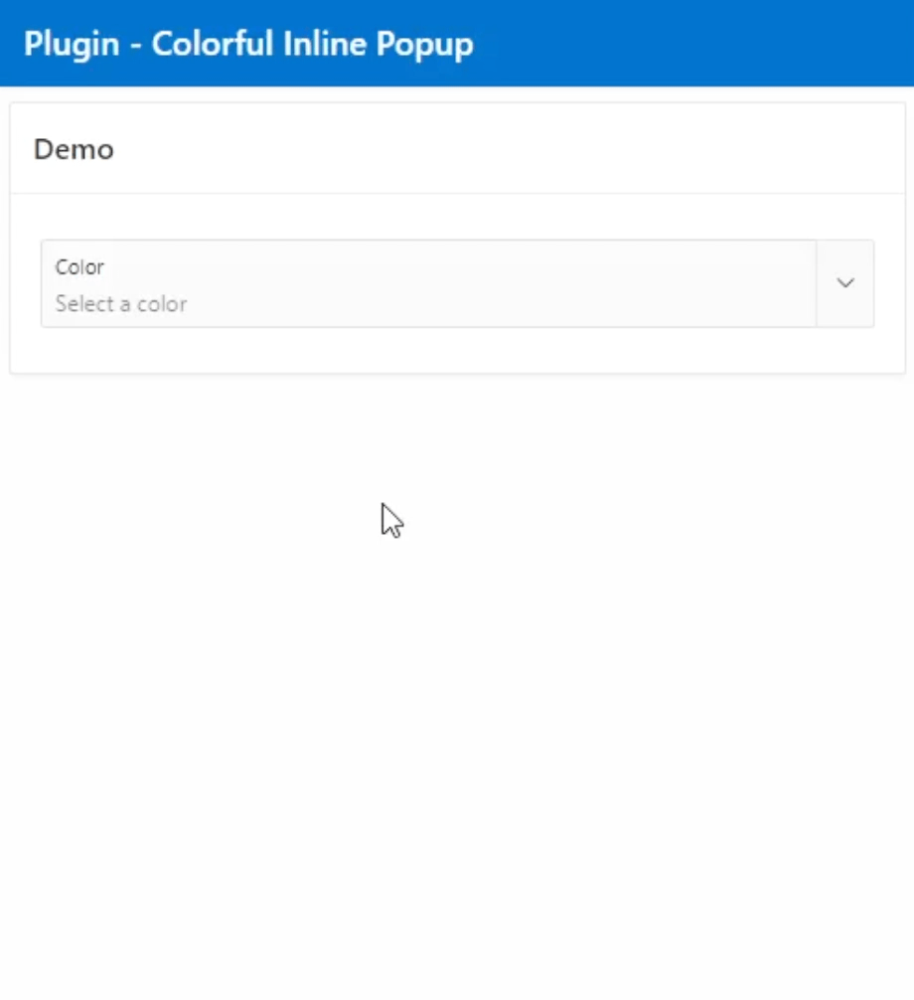
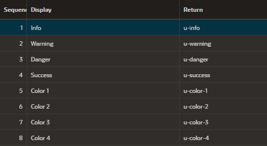
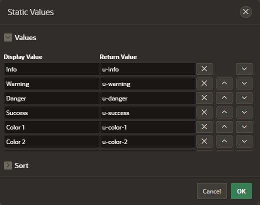

# APEX - Colorful Inline Popup

**Colorful Inline Popup** is a Plugin to select a color class or hex code with Popup LOV.

##### Table of Contents

* [Plugin in Action](#plugin-in-action)  
* [How it works](#how-it-works)
* [List of Values Example](#list-of-values-example)
* [License](#license)

## Plugin in Action

## How it works

1. Create a Page Item with Type ``Popup LOV``. In ``Settings`` > ``Display As`` you should select ``Inline Popup``.
2. Create a Dynamic Action on your Page Item . In ``When`` > ``Event`` select ``Click``.
3. As True Action select ``VS - Colorful Inline Popup [Plug-In]`` without ``Fire on Initialization``

## List of Values Example

The List of Values Source can be a Shared Component or a Static Value. With a Name as Display name and the HTML-Class as the value.  

## License

[MIT](./LICENSE)
